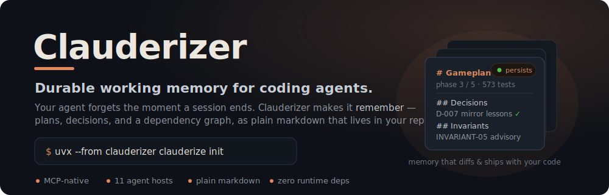
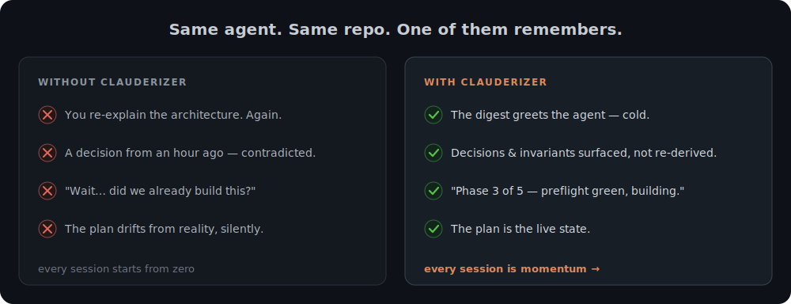
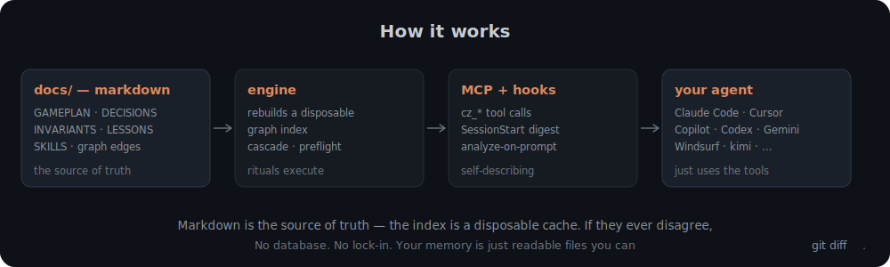

<p align="center">
  
</p>

<p align="center">
  <a href="https://pypi.org/project/clauderizer/"></a>
  <a href="https://pypi.org/project/clauderizer/"></a>
  <a href="https://github.com/collincusce/Clauderizer/actions/workflows/test.yml"></a>
  <a href="LICENSE"></a>
</p>

<p align="center">
  <b>Your coding agent is brilliant — and amnesiac.</b> Every new session it forgets your
  architecture, your decisions, what's already done.<br>
  <b>Clauderizer gives it a memory that survives</b> — plans, decisions, and a dependency graph
  as plain, git-diffable markdown it reads and updates through real tool calls.
</p>

```bash
uvx --from clauderizer clauderize init
```

It's the active, MCP-native successor to a battle-tested markdown "gameplan" convention —
and it was built by dogfooding itself: Clauderizer planned, tracked, and shipped its own
construction. (The release that added skill-awareness? Its agent ran the whole 5-phase
gameplan through these very tools.)

---

## Why you'd want it

Long-running AI work hits two walls:

1. **A fresh session starts blank.** Every "where were we?" is re-derived from scratch — or re-explained by you for the tenth time.
2. **A long session fills its context window** mid-task and forgets its own earlier decisions.

The usual answer is *conventions*: "keep a decisions log," "write a handoff," "run cascade
after edits." But conventions rely on the agent **remembering to follow them**, so they rot —
the cascade script never gets built, lessons stop propagating, the plan quietly drifts from
reality. (If you've watched an agent confidently contradict a decision it made an hour ago,
you know the failure mode.)

<p align="center">
  
</p>

Clauderizer keeps the proven *model* of that convention and makes it a **system** instead of a
hope:

| Goal | How |
|---|---|
| 🔎 **Discoverable** | Self-describing MCP tools + lifecycle hooks (SessionStart digest, analyze-on-prompt, compaction-survival) that inject status into context — automatically on hook-capable hosts, via `/cz-status` on prompt-capable ones, and via the `AGENTS.md` floor everywhere else. No "read these 7 files in this order" ritual. |
| 🎛️ **Configurable** | A real `pet` / `standard` / `saas` size dial and host-language profiles — *data*, not prose advice. |
| 🤖 **Agentic** | Cascade, pre-flight, and handoff assembly are real tool calls — not instructions the agent has to remember to run. |
| 📦 **Drop-in** | One command clauderizes any repo, in any language. |
| 🧩 **Host-portable** | One install targets your agent — Claude Code, Cursor, Copilot, Codex, Gemini CLI, Windsurf, Cline, Amp, Continue, Zed, or kimi. Host-neutral MCP + an injection-parity ladder, not a Claude-only bet. |

> **Markdown is the source of truth.** The graph index is a disposable cache rebuilt from the
> markdown on demand — if they ever disagree, markdown wins. No database, no lock-in: your
> memory is just readable files in `docs/`.

If you've tried to get this from a fatter `CLAUDE.md` or a personal assistant's memory:
prose conventions rot because nothing executes them, and personal-agent memory follows the
*person*. Project memory belongs **in the repo** — where it ships, diffs, and reviews with
the code — as tool calls the agent can't forget to make, not advice it has to remember.

---

## What a session actually feels like

You open a fresh agent session in a clauderized repo. Before you type a word, the SessionStart
hook has already told the agent exactly where things stand — and it gets to work:

<p align="center">
  
</p>

No reading order, no re-briefing.
A typical loop:

```
cz_next_phase_context   → the full bundle for this phase (read-only; assembles, doesn't write)
cz_preflight            → runs the host project's real tests/build/lint, for real, not "claimed"
… do the work …
cz_add_decision / cz_add_invariant / cz_add_finding / cz_upsert_entity   → structured records
cz_cascade              → walk the graph, flag dependents that may need updating
cz_write_handoff        → assemble the next cumulative handoff (all still-relevant lessons)
```

Every write goes through one idempotent path, so IDs auto-number and frontmatter stays valid —
the agent never hand-mangles your docs.

---

## How it works

<p align="center">
  
</p>

---

## Quickstart: from an empty folder

Brand-new project with nothing in it — not even Clauderizer installed? Three steps.

**1. Make the repo and clauderize it.** `uvx` runs Clauderizer without installing anything:

```bash
mkdir my-project && cd my-project
git init                                # recommended — pre-flight uses git
uvx --from clauderizer clauderize init --size standard   # scaffolds docs/, CLAUDE.md, skills, MCP server, hook
uvx --from clauderizer clauderize doctor                 # confirm the MCP server + hook are actually runnable
```

> `standard` suits most repos. `pet` is lighter (fewer docs, no cascade); `saas` adds the full
> doc set — but as initially-empty stubs you fill in over time, so start at `standard` unless
> you know you want more.

> No language to detect yet, so the host profile starts as `generic`. Once your first phase
> adds a `package.json` / `pyproject.toml` / `go.mod` / `Gemfile`, just re-run
> `clauderize init` (it's idempotent) and the profile switches to the real one, enabling
> pre-flight tests.

**2. Open a Claude Code session in the folder.** The SessionStart hook greets the agent with
the (currently empty) status automatically — no setup prompt needed.

**3. Write the very first prompt.** Point the agent at the goal and let it build the plan:

> *Plan a gameplan to **\<one sentence: what you're building\>**. It's a brand-new
> **\<stack, e.g. "TypeScript + Vite"\>** project with nothing in it yet. Ask me whatever you
> need to pin down scope, then create the gameplan: capture the key decisions and break it
> into session-sized phases — start with a phase that scaffolds the project. Show me the plan
> before we execute.*

That fires the `new-gameplan` skill: the agent clarifies scope with you, records the decisions,
lays out the phases, and writes the Phase 0 handoff. From there every session is just:

> *Do the next phase.*

Phase 0 typically scaffolds the project itself, so by the time it's done you have a real,
building codebase tracked by a real plan — and the memory to resume it cleanly in any future
session.

---

## Quickstart: into an existing project

Already have a codebase? Clauderizer drops in without disturbing it — `init` is idempotent and
never clobbers your files: it adds a marker stanza to an existing `CLAUDE.md`, key-merges your
host's MCP config (`.mcp.json` for Claude Code; see [Works with your agent](#works-with-your-agent)),
and skips any doc that already exists.

**1. Clauderize the repo.** Run it on a clean working tree (or a fresh branch) so the change is
easy to review:

```bash
cd my-existing-repo
uvx --from clauderizer clauderize init --size standard   # auto-detects node / python / go / ruby
uvx --from clauderizer clauderize doctor                 # confirm it's wired AND runnable
```

Because your project already has a language, pre-flight runs your **real** test/build/lint
commands from the start (tweak them in `.clauderizer/profile.lock.toml` if your repo is
non-standard). Commit this diff on its own branch/commit so adopting Clauderizer is a clean,
reviewable change in your history. (One thing stays out of that commit: the host's MCP config —
`.mcp.json` for Claude Code — is gitignored whenever it holds machine-specific paths, so it never
breaks a teammate. Each clone just re-runs `clauderize init` to regenerate its own wiring, and
`doctor` flags it if it's missing.)

**2. Open a Claude Code session.** The hook injects status (no gameplan yet).

**3. (Recommended) Seed memory from what already exists** — so the graph reflects reality before
you build on it:

> *Before we plan anything, skim this codebase and seed Clauderizer's memory: capture the major
> subsystems as entities, the load-bearing decisions and invariants you can infer, and the real
> baseline (current test count, language/framework versions) as source-of-truth. Don't change
> any code — just record.*

**4. Plan your first initiative** — the first prompt points at a feature or change *on top of*
the existing code:

> *Plan a gameplan to **\<the initiative, e.g. "add OAuth login"\>**. This is an existing
> **\<stack\>** codebase — read the relevant code first, capture source-of-truth values, record
> the key decisions, and break it into session-sized phases with verifiable exit criteria. Show
> me the plan before we execute.*

Then, as always:

> *Do the next phase.*

---

## Working with gameplans (how you actually drive it)

**You talk to the agent in plain English; Claude does the tool calls.** You almost never
invoke a `cz_*` tool yourself — the six skills `init` installs auto-trigger on what you say
(and also work as slash commands, e.g. `/clauderizer-do-phase`). The only thing that's fully
automatic is the **SessionStart hook**: every session opens with the current status already in
context, so the agent knows where things stand before you type a word.

The whole lifecycle is just natural language:

| You say… | Skill | What the agent does |
|---|---|---|
| *"Plan a gameplan to ship the billing system"* | `new-gameplan` | clarifies the goal, captures real source-of-truth values, then `cz_create_gameplan` → `cz_add_decision` → `cz_add_phase` ×N → writes the Phase 0 handoff |
| *"Do the next phase"* · *"continue"* · *"work on phase 3"* | `do-phase` | `cz_next_phase_context` → `cz_preflight` (runs your real tests/build) → does the work → records outcomes → `cz_cascade` → `cz_write_handoff` |
| *"Remember we decided X"* · *"note that…"* · *"that was a mistake, the fix is…"* | `record` | routes to the right `cz_add_decision` / `cz_add_invariant` / `cz_add_lesson` / `cz_add_correction` / `cz_add_finding` |
| *"Scope changed — add a task for Y"* | `amend` | `cz_add_amendment`, cascading to affected phases |
| *"Close out the gameplan"* | `close-gameplan` | full cascade, updates project docs, writes a `POST-MORTEM.md` |
| *"Where are we?"* | — | `cz_status` (or just read what the hook already injected) |

So the day-to-day rhythm is:

```text
clauderize init                         # once, per repo
"Plan a gameplan to <your goal>"        # the agent breaks it into phases
"Do the next phase"                     # …repeat each session until done
"Remember that <decision/lesson>"       # capture as you go; it propagates forward
"Close out the gameplan"                # when every phase is done
```

You steer; Claude keeps the memory, the graph, and the rituals honest between sessions.

---

## Running several gameplans at once

One repo, more than one long-lived initiative — say a **code** gameplan and a **marketing
campaign** — each advanced in its own sessions, without losing the other.

- **Focus.** One gameplan is the *focus* (the default target for status, do-phase, handoff,
  preflight). Switch with `clauderize focus <id>`; see them all with `clauderize gameplans`. The
  status digest grows a portfolio block automatically once a second gameplan is open — and a
  single-gameplan repo reads exactly as before.
- **Kinds.** A gameplan has a **kind** — `driven` (code), `loop` (maintenance), `campaign`
  (creative), or your own in `.clauderizer/kinds/<name>.toml`. The kind sets the vocabulary, the
  starting phase, and the preflight checks. The vocabulary is presentation-only: a campaign reads
  in *stages* and *assets*, but the file structure is identical, so everything else just works.
- **Its own preflight.** A campaign's preflight runs *its* QA gates (virality, brand-lint,
  duration, …) — generic shell commands you wire in `.clauderizer/preflight.<kind>.toml` — instead
  of tests/build. Clauderizer ships the mechanism; you supply the checks.
- **Cross-gameplan dependencies.** When the campaign relies on a tool the code gameplan builds,
  say so once (`cz_consumes`); changing that tool then flags the campaign axis too — the cascade
  walks across gameplans, not just within one.

*"a campaign **is** a gameplan"* — the same phased, decision-logged, exit-criteria control
structure, just over creative assets instead of code.

---

## Maturity: 1.0 — stable, with receipts

The classifier says **Production/Stable**, and it earned it — every 1.0 readiness gate is
public evidence, not vibes. The
[1.0 gates](https://github.com/collincusce/Clauderizer/blob/main/docs/RELEASING.md)
the 1.0 readiness gates are satisfied with dated artifacts: releases are gated by `clauderize release-check`
(a fresh four-registry sweep + push-ordering, exit 0 *before* any tag); the suite runs green
on ubuntu/macos/windows × py3.11–3.13 with the Windows wrapper *executed*, not simulated; the
cold start is proven in a real fresh session (the SessionStart hook **and** the MCP transport
firing cold, the live digest matching the tools); and the full loop is proven on a non-python
repo. The quickstart below runs against the **published package on a clean CI machine on every
push** — and the findings tracker
([HARDENING.md](https://github.com/collincusce/Clauderizer/blob/main/docs/HARDENING.md))
is append-only and all-resolved, each finding with dated evidence.

## Docs

- **[TRUST.md](https://github.com/collincusce/Clauderizer/blob/main/docs/TRUST.md)** — what
  init writes, what executes when, and the contracts each surface honors (every claim cites
  the code that implements it).
- **[TROUBLESHOOTING.md](https://github.com/collincusce/Clauderizer/blob/main/docs/TROUBLESHOOTING.md)**
  — the "no digest at session start" ladder, the breadcrumb decoder, doctor's exit-code
  contract.
- **[UPGRADING.md](https://github.com/collincusce/Clauderizer/blob/main/docs/UPGRADING.md)**
  — upgrades are two moves; uninstalling keeps `docs/` (your memory, not the tool's).
- **[RELEASING.md](https://github.com/collincusce/Clauderizer/blob/main/docs/RELEASING.md)**
  — the mechanical release ritual and the 1.0 readiness gates with their evidence table.

## Install


```bash
pipx install "clauderizer[mcp]"   # regular use (engine + MCP server; gives you a bare `clauderize`)
# or zero-install:
uvx --from clauderizer clauderize init
```

The core engine has **no runtime dependencies**; the `mcp` extra is only needed to run the
MCP server. `init` prefers the installed `clauderizer-mcp`/`clauderizer-hook` scripts (venv /
pipx) and otherwise wires the durable `uvx --from clauderizer …` form — never a uvx
ephemeral-cache path (those die on `uv cache clean`) — so it wires up correctly on native
Linux, macOS, and Windows→WSL alike. Zero-install users: every `clauderize <cmd>` in these
docs is `uvx --from clauderizer clauderize <cmd>` until you install properly.

## Update to the latest version

Updating is the same two moves for everyone — refresh the **engine** (the package), then
refresh the **wiring** (`init`):

```bash
# zero-install (uvx), the common case: one --refresh re-primes uv's cache, so the
# wired hook + MCP server resolve the new version on your next session.
uvx --refresh --from clauderizer clauderize init
uvx --from clauderizer clauderize doctor          # expect exit 0 — names the running version

# installed the package instead? upgrade it first, then re-run init:
pipx upgrade clauderizer        # pipx installs
uv tool upgrade clauderizer     # uv tool installs
```

`init` is idempotent: it refreshes only engine-owned files and never touches your `docs/`
memory, your `CLAUDE.md` text, or your `.clauderizer/profile.lock.toml` edits. Without
`--refresh`, `uvx` keeps serving its cached version — that one flag is the whole update.
Full detail, including what `doctor` reports after an update, is in
[UPGRADING.md](https://github.com/collincusce/Clauderizer/blob/main/docs/UPGRADING.md).

## What `init` drops in

```
your-repo/
├── CLAUDE.md                    # a Clauderizer stanza (between markers — your text is preserved)
├── AGENTS.md                    # a byte-identical copy of the CLAUDE.md stanza (hosts read whichever they support)
├── <host MCP config>            # registers the clauderizer MCP server — path is host-specific:
│                                #   .mcp.json (Claude Code), .cursor/mcp.json, .vscode/mcp.json,
│                                #   .zed/settings.json, … (auto-written for hosts with a JSON config;
│                                #   TOML/global hosts get a setup guide instead — see docs/CROSS-HOST.md)
├── .claude/
│   ├── settings.json            # SessionStart + UserPromptSubmit hooks (fire every prompt; the digest injects once/session)
│   └── skills/clauderizer-*/    # six workflow skills (/do-phase, /cascade, /record, …)
├── .clauderizer/
│   ├── config.toml              # size dial + host profile + session host + host target + active gameplan
│   ├── hook.sh                  # breadcrumb hook wrapper (hook.cmd on native Windows)
│   ├── <host>-setup.md          # non-destructive wiring guide for guide-only hosts (kimi, Codex, Windsurf)
│   ├── profile.lock.toml        # per-project test/build/lint commands (editable override)
│   └── index.json               # disposable graph cache (gitignored)
└── docs/                        # the canonical markdown memory
    ├── VISION.md, ARCHITECTURE.md, DECISIONS.md, INVARIANTS.md, HARDENING.md, …
    └── gameplans/
        ├── GAMEPLAN-PROCEDURE.md
        └── <date>-<name>/       # GAMEPLAN, handoffs, cascade reports, status
```

`init` is **idempotent**: re-running fills gaps and refreshes engine-owned files but never
clobbers your content (marker blocks, key-scoped JSON merges, exists-checks). Run
`clauderize doctor` any time to verify the install is not just *present* but actually
*runnable by the host that spawns your sessions* — and that the engine it reaches is the
version answering the doctor (a green check on a broken setup is worse than no check).

## Works with your agent

The MCP server is host-neutral (`uvx --from clauderizer clauderizer-mcp` — never a machine
path), so one install targets whichever agent you drive. `init` reads the **host target** from
config (`[host] target`, default `claude-code`) and writes that host's MCP config in its own
place — non-destructively, preserving any other servers:

**11 supported hosts** — Claude Code · Cursor · GitHub Copilot / VS Code · OpenAI Codex CLI ·
Google Gemini CLI · Windsurf · Cline · Amp · Continue.dev · Zed · kimi.

How a session learns where things stand degrades gracefully — best reachable tier wins, and
status is delivered at most once per session:

- **Hook hosts** get it **automatically** — the lifecycle hook injects the status digest at
  session start (Claude Code, kimi, Copilot, Codex, Gemini CLI, Windsurf, Cline, Amp).
- **Prompt hosts** get a **`/cz-status`** slash command (Cursor, Copilot, Continue, Gemini, Zed).
- **Everyone** gets the floor: `AGENTS.md` (or a native rules file for the few hosts that don't
  read it) tells the agent to call `cz_status` first — and the MCP server attaches a status note
  to the first tool call as an automatic fallback for hook-less hosts.

See **[docs/CROSS-HOST.md](https://github.com/collincusce/Clauderizer/blob/main/docs/CROSS-HOST.md)**
for the full per-host capability matrix. Switching hosts later is `clauderize init --host <name>` (or a `[host] target`
config edit + re-`init`); `clauderize uninstall` cleanly reverses the wiring,
keeping your `docs/` memory.

## The model

- **Gameplan → Phase → Task** — a coherent initiative, broken into session-sized phases,
  broken into tasks.
- **Project DAG** — long-lived entities (`subsys.*`, `feat.*`, `ext.*`, `D-NNN`, `INVARIANT-NN`)
  declared via frontmatter; edges are `depends_on` (with semver pins). Query it with
  `cz_graph_query`.
- **Cascade** — after a tracked change, walk the DAG forward and reconcile dependents. It's
  *post-hoc and judgment-based*: the tool finds what might be affected and marks it "needs
  review"; the agent decides. (No more "I'll build the cascade script later" — it's built in.)
- **Cumulative handoffs** — every handoff carries all still-relevant lessons forward,
  assembled from one canonical list, so phase N+3 never repeats a mistake phase N already solved.
- **Append-only memory** — decisions, invariants, hardening findings, incidents, corrections,
  and lessons are never deleted, only superseded. A permanent audit trail.
- **Consolidation pressure, not caps** — cumulative memory could otherwise crowd out the
  context window it serves. Overlapping lessons get synthesized (`cz_consolidate_lessons`),
  enduring ones promoted to a compact `docs/LESSONS.md` that rides in every future handoff
  across gameplans (`cz_promote_lesson`), and the status digest carries a memory gauge that
  warns when the active-lesson count crosses the line. Nothing is ever auto-deleted.

## CLI

```bash
clauderize init [--size pet|standard|saas] [--profile auto|node|python|go|ruby]
                [--gameplan "Name"] [--run-cmd "uvx --from clauderizer"]
                [--host <name>] [--list-hosts]   # which agent tool drives this repo (default claude-code)
                [--session-host native|windows-wsl:<distro>] [--no-spawn-test]
clauderize status [--json]   # the current digest
clauderize gameplans [--all] [--json]   # list open gameplans (the portfolio); --all includes finished
clauderize focus [<id>] [--json]        # switch the focus gameplan (default target); no id = report focus
clauderize doctor            # present AND runnable for the session host of record;
                             # exit 0 ok · 1 not clauderized · 2 drift · 3 ok-but-unverifiable
clauderize reindex           # rebuild the graph cache from markdown
clauderize release-check     # maintainers: push ordering + the four version registries · exit 0 ok · 2 red · 3 unverifiable
clauderize mcp               # launch the MCP server (stdio)
clauderize ops <file.json|-> # execute a JSON batch of cz_* ops (the no-MCP write fallback)
clauderize ops --list        # discover every op: name, read/write, summary, required args
clauderize ops --schema <op> # show one op's required + optional args (JSON)
clauderize uninstall [--host <name>]   # reverse the full footprint (MCP config + hooks + stanzas + skills + .clauderizer/); --host scopes to one; docs/ always kept
```

## MCP surface

**Read** · `cz_status` · `cz_next_phase_context` · `cz_gameplans` · `cz_graph_query`
**Rituals** · `cz_preflight` · `cz_cascade` · `cz_resolve_cascade` · `cz_write_handoff`
**Mutations** · `cz_create_gameplan` · `cz_focus` · `cz_add_phase` · `cz_transition_phase` · `cz_add_amendment`
· `cz_add_decision` · `cz_add_invariant` · `cz_add_finding` · `cz_resolve_finding` · `cz_add_lesson`
· `cz_obsolete_lesson` · `cz_consolidate_lessons` · `cz_promote_lesson`
· `cz_add_correction` · `cz_add_output` · `cz_add_phase_summary`
· `cz_upsert_entity` · `cz_consumes` · `cz_transition_status`
**Discipline & analysis** (advisory — they surface findings for you to act on, never changing anything on their own) · `cz_analyze` · `cz_critique` · `cz_mine_failures` · `cz_corpus_health` · `cz_lesson_health` · `cz_curate` · `cz_loop_step` · `cz_add_open_item` · `cz_resolve_open_item` · `cz_set_exit_criteria` · `cz_check_exit_criterion`
**Skills** (Clauderizer finds the skills your project already has and proposes them — you confirm; never auto-added) · `cz_register_skill` · `cz_obsolete_skill` · `cz_discover_skills`
**Resources** · `clauderizer://status` · `clauderizer://procedure` · `clauderizer://entity/{id}`
**Prompts** · `cz-status` · `cz-next-phase` — surface as slash commands (e.g. `/cz-status`) on prompt-capable hosts

In total: **41 tools + 3 resources + 2 prompts**.

The tools are deliberately separate and self-describing rather than one generic `mutate` — that's
the whole point of going MCP-native: an agent dropped into the repo *discovers* the workflow from
the tool schemas, no documentation pass required.

## No MCP client? Every write still works

The `cz_*` tools are the front door, not a dependency. `clauderize ops` executes the same
operations — same names, same arg shapes, same shared registry — from the command line:

```bash
clauderize ops --list                    # discover every op: name, read/write, summary, required args
clauderize ops --schema cz_add_lesson    # one op's required + optional args (from the shared registry)
echo '[{"op": "cz_add_lesson", "args": {"text": "…", "category": "Process"}}]' > batch.json
clauderize ops batch.json        # or `clauderize ops -` to read the batch from stdin
```

You don't have to know the op names by heart — `--list` and `--schema` read the *same*
registry the MCP tools use, so the CLI and the agent surface can never drift.

Per-op JSON results land on stdout (exit 0 all-ok, 1 any-op-failed, 2 unreadable batch), and
writes hold the same advisory write lock as the MCP server — so a session whose wiring is
broken can still record exactly what broke. Args live in files by design: no shell-quoting
hazards on any host.

## Split-host wiring (Windows → WSL) — wiring that can't lie

Sessions and the engine don't always share a host: Claude Code on Windows over
`\\wsl.localhost\…` spawns commands *Windows* must launch, even when the engine lives in a
WSL venv. Clauderizer records the **session host of record** (`native` or
`windows-wsl:<distro>`) in config, composes wiring for it (the `wsl.exe -d <distro>` shim,
command/args split for `.mcp.json`, one command string for the hook), and `init`
**spawn-tests every command before writing it** — a command that can't answer `--version`
is refused with nothing written.

Three guards keep the wiring honest after that:

- **The SessionStart hook is a breadcrumb wrapper** (`.clauderizer/hook.sh` / `hook.cmd`):
  it always spawns, and any engine failure prints
  `[Clauderizer] engine unreachable: … — run clauderize doctor` *into the session context*
  instead of dying silently.
- **`clauderize doctor` verifies for the host of record**: it certifies the wiring through a
  real round-trip spawned the way sessions spawn it, or honestly reports "unverifiable from
  this host" (exit 3) — never a false green from the wrong side of the boundary.
- **Identity, not just launchability**: the round-trip must come back claiming
  `clauderizer <version>` — the same version as the doctor you're running. A stale pinned
  engine (`uvx --from "clauderizer[mcp]==0.5.0"` *launches fine*) and a dead engine hiding
  behind the always-exit-0 wrapper both fail loudly instead of certifying green.

## Configurable two ways

**Size dial** — `pet` (just a gameplan + handoffs), `standard` (named docs + cascade + full
8-check preflight), `saas` (the full doc set + incidents + amendments). It governs which doc
modules and rituals are active. It's a data manifest, not a fork.

**Host-language profiles** — the engine reads/writes markdown and is agnostic to your project's
language. Support for a language is a *profile*: a data file describing its test/build/lint/
typecheck commands. Ships with Node, Python, Go, Ruby, and a generic fallback; need per-project
commands? Edit `.clauderizer/profile.lock.toml` and they take effect. Adding a language is a new
`<lang>.toml`, not code.

## Development

```bash
uv venv && . .venv/bin/activate
uv pip install -e ".[mcp,dev]"
pytest
```

### Releasing (maintainers)

Publishing is automated and tokenless via **PyPI Trusted Publishing** (OIDC) — no secrets stored.
One-time setup on PyPI → the `clauderizer` project → *Publishing* → add a trusted publisher:
owner `collincusce`, repo `Clauderizer`, workflow `publish.yml`, environment `pypi`.

Each release follows
**[docs/RELEASING.md](https://github.com/collincusce/Clauderizer/blob/main/docs/RELEASING.md)**
to the letter: stage the version bump, **push first**, then `clauderize release-check` must
exit 0 *before* any tag exists — it sweeps all four version registries fresh and verifies push
ordering. Only then tag the pushed commit and cut the GitHub Release (`publish.yml` refuses
tag/source skew before building).

## License

[Apache License 2.0](LICENSE) — permissive, with an explicit patent grant. Copyright 2026
Clauderizer contributors; see [NOTICE](NOTICE).
